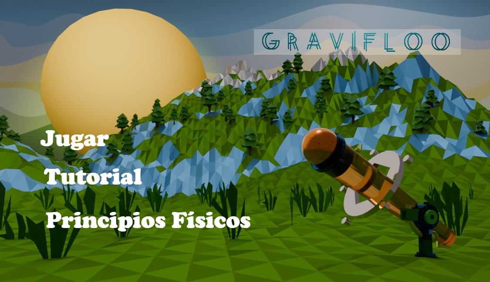
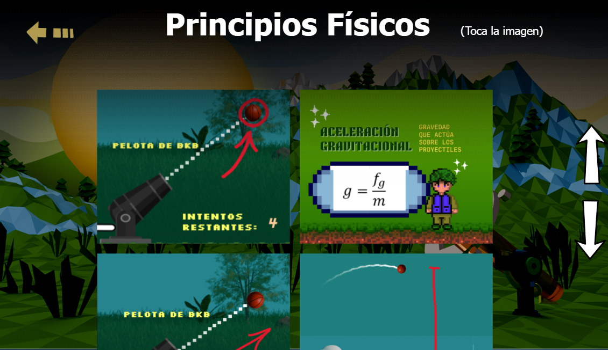
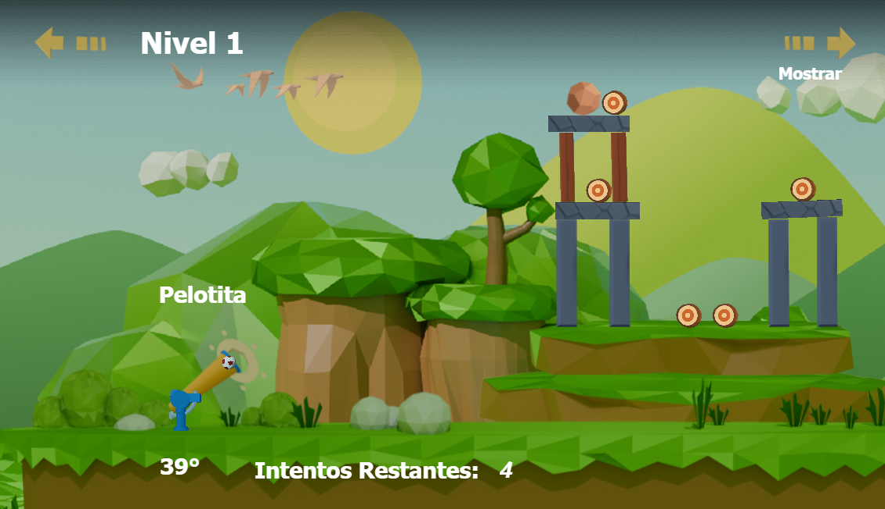
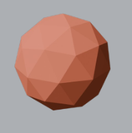
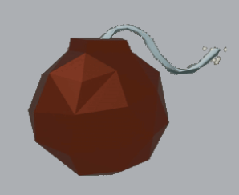
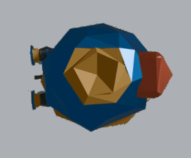
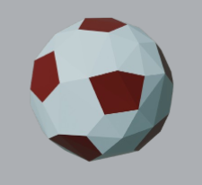
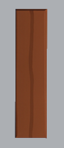
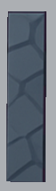

# Gravifloo

Gravifloo es un videojuego educativo que combina diversión y aprendizaje, diseñado para enseñar física de manera progresiva a través de niveles con diferentes condiciones gravitacionales. El jugador experimenta cambios reales de gravedad, materiales, proyectiles y estructuras, todo dentro de un entorno interactivo creado con Construct 2.

---

## 📘 Mecánica principal

Cada nivel está cuidadosamente diseñado para introducir conceptos físicos de forma gradual. El comportamiento del entorno y los objetos cambia según la gravedad del nivel y los materiales utilizados.

---

## 🌍 Gravedad por niveles

### **Niveles 1–5: Gravedad Terrestre (9.8 m/s²)**

Los primeros niveles simulan la gravedad clásica de la Tierra. Aquí, el jugador aprende:

* Caída libre
* Peso
* Fuerza gravitacional
* Control básico del personaje

### **Niveles 6–10: Gravedad Lunar (1.6 m/s²)**

A partir del nivel 6, la jugabilidad cambia drásticamente:

* Las caídas son más lentas
* Los saltos son más largos y altos
* Se requiere mayor precisión y estrategia
* El peso de los objetos se siente diferente

Esto introduce al jugador a la relación entre masa, peso y fuerza gravitatoria.

---

## 🎯 Proyectiles

Los proyectiles del juego poseen diferentes pesos y comportamientos físicos:

### **BKB**

* Peso ligero
* Gran capacidad de rebote

### **Bomba**

* Peso mayor
* Capacidad de explotar

### **Cohete**

* Peso liviano
* Aceleración elevada
* Puede volar más rápido que otros proyectiles

### **Pelotita**

* Súper ligera
* Fuerza reducida
* Ideal para aprender trayectorias y colisiones simples

---

## 🧱 Materiales y estructuras

Cada estructura del juego está diseñada para enseñar resistencia, colisión y física aplicada.

### **Madera**

* Liviana y frágil
* Fácil de romper o mover
* Ideal para comprender fuerzas básicas

### **Piedra**

* Resistencia intermedia
* Más sólida que la madera
* Puede fracturarse bajo ciertas condiciones

### **Metal**

* El material más resistente del juego
* Soporta grandes cargas e impactos
* No se deforma fácilmente

---

## 🛠️ Recursos utilizados

El desarrollo visual requirió diversas herramientas profesionales:

### **GIMP**

* Creación de normal maps
* Nubes
* Displacement maps

### **Blender**

* Modelado 3D
* Diseño de escenarios
* Creación de animaciones

### **Illustrator**

* Diseño de fondos y paisajes con vectores
* Creación de elementos visuales limpios y escalables

### **Photoshop**

* Edición avanzada de texturas
* Ajustes de color y composición

### **Construct 2 (Motor del juego)**

* Desarrollo del gameplay
* Control de física, niveles y lógica del jugador

---

## 📉 Dificultades

El desarrollo incluyó una curva de aprendizaje considerable:

* **Blender**: complejo por la variedad de herramientas (modelado, animación, render).
* **Illustrator**: requiere precisión en vectores.
* **GIMP**: interfaz poco intuitiva al inicio.

A pesar de eso, **todas las metas del proyecto se cumplieron** y el resultado visual integra Blender, Photoshop, Illustrator y recursos online.

---

## 🚀 Distribución

El videojuego será completamente **open source**.
Estará disponible en:

* **GitHub** (código fuente)
* **Netlify** (versión jugable en línea)

---

## 👥 Creadores

1. Ricardo Arévalo → https://github.com/Riahrell
2. Luis Martínez → https://github.com/BlckXI
3. Josué Melara → https://github.com/JosuMelara21
4. Steven Trujillo → https://github.com/imTrujillo
